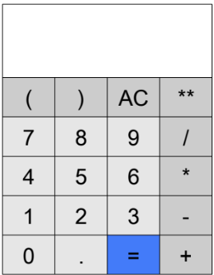
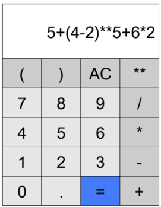
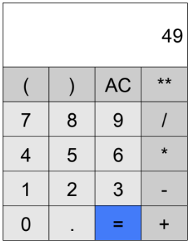

## Introduction

In this activity, you will implement a simple calculator with a graphical user interface using the `tkinter` library. You will
need the following items:

- Raspberry Pi

- LCD Screen (optionally a touch screen)

- Keyboard and mouse

::: {.callout-note}
If you wish, you can complete this activity on your laptop with the Python interpreter (and your choice of IDE) installed since you will not be using the GPIO pins on the RPi. 
:::

## Goal GUI

Let's begin by taking a look at a model of the GUI for The Reckoner:

{fig-align="center"}

The top portion represents the display where expressions and their results can be viewed. The bottom portion includes various buttons that either represent operands (by combining the digits 0 through 9 and/or the decimal point), operators that perform various arithmetic operations, or special-purpose actions: clearing the display `AC` and evaluating expressions `=`. 

The abbreviation `AC` on a calculator stands for **All Clear**. For The Reckoner, it will clear the display. The `**` operator is Python's exponentiation operator (i.e., $x^{y}$).

By clicking or tapping on the various buttons, simple or complex expressions can be displayed such as `5+(4-2)**5+6*2`.

{fig-align="center"}

By subsequently clicking or tapping on the equal button `=`, the expression can be arithmetically evaluated as `49`.

{fig-align="center"}

## Installing a Font

The font that is used in the images shown is called **TexGyreAdventor**. It is freely available and can be obtained at [Font Squirrel](https://www.fontsquirrel.com/fonts/tex-gyre-adventor). Check with your professor for use of any fonts that are not the default font or **TexGyreAdventor**. 

To install **TexGyreAdventor** on the Raspberry Pi complete the following two steps:

1. Download the OTF files from [Font Squirrel](https://www.fontsquirrel.com/fonts/tex-gyre-adventor)

2. Copy the OTF files to the proper place on the RPi's file system.

    ```
    # first navigate to where the font downloaded
    cd ~/Downloads

    # now copy the font to the fonts folder
    sudo cp tex*.otf /usr/local/share/fonts
    ```

3. Reboot the RPi using the command `reboot` in the terminal. 

::: {.callout-note}
Note that on most Linux systems, you can double-click the OTF files and install them that way. At the time of writing this, this was not possible on Raspberry Pi OS.
:::


## Breakdown

In this activity, we'll take an iterative approach to creating The Reckoner. 

1. First, we'll create the GUI and ensure that it is correct before proceeding and test/fix any issues with the GUI before proceeding. 

2. Next, we will integrate code that will handle the button clicks/taps. As buttons are clicked/tapped, our program must accurately detect which button was clicked/tapped and, furthermore, perform some action that is appropriate for that specific button. 

2. Next, we'll work through and integrate evaluating the expression. To simplify things a bit, we'll hand that off to Python! Since it is possible that an expression has errors (e.g., mismatched parentheses, multiple consecutive operators, etc), we'll finally integrate error checking so that user errors don't unexpectedly *break* our program.

4. Last, you'll be given some homework to extend the calculator's functionality.


