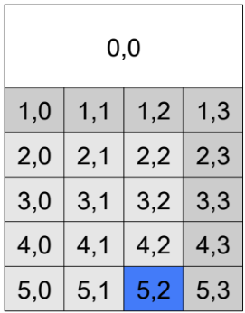
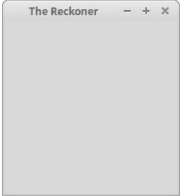
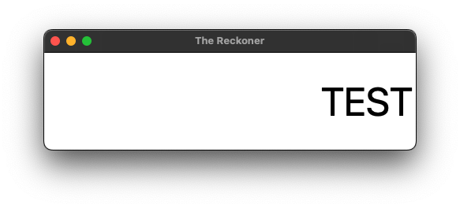
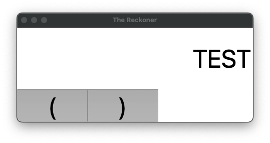
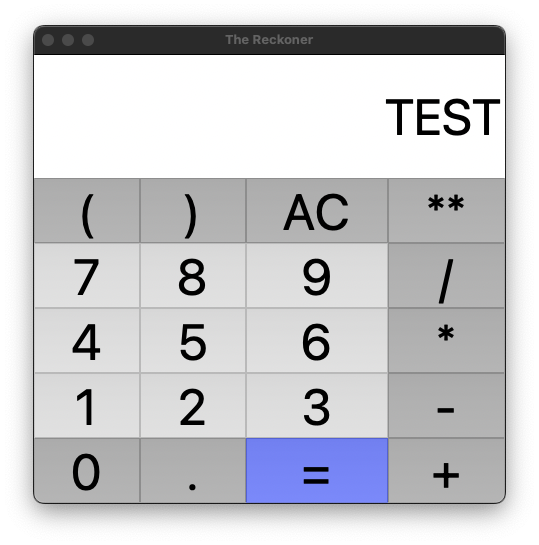

## Overview 

To create the GUI, we'll use Tkinter's grid manager. The grid manager allows the placement of widgets using a row/column approach. More specifically, we will layout the grid as follows:

- The display will be located at row 0, column 0, and span four columns. 

- The top row of buttons (`(`, `)`, `AC`, and `**`) will be located at row 1, columns 0 through 3. 

- The remaining buttons will be placed in increasing rows, at columns 0 through 3. 

Below, you'll find a picture of the calculator layout with row and column numbers:

{fig-align="center"}

## A Template to Start

Let's first work on a template for The Reckoner. Be sure to fill in the name, date and description fields. 

```python
#################################################################
# Name:
# Date:
# Description
#################################################################
from tkinter import *

# the main GUI
class MainGUI(Frame):
    
    def __init__(self, parent):
        """Constructor for MainGUI"""


    def setupGUI(self):
        """Sets up the Graphical User Interface"""

##############################
# the main part of the program
##############################
# create the window


# set the window title


# generate the GUI


# display the GUI and wait for user interaction


```

Note how this simply sets up a shell that we can work with. Of course, a header will be included at the top. 

Since we will make use of the Tkinter library, it will have to be imported. We use the general `*` to unpack `tkinter` with `from tkinter import *` here since we do not plan on having conflicts with other libraries. 

Next, we'll specify the class that will represent The Reckoner's main GUI (named `MainGUI` in the code above). This class will be a Tkinter `Frame`; therefore, it will inherit from Tkinter's `Frame` class. 

After the class, we'll include the main part of the program. It creates the window, sets its title, creates an instance of the `MainGUI` class (thereby generating the calculator GUI), and finally displays the GUI and waits for user interaction.


## The `main` Section

Now we provide details for the main part of the program. The `main` portion of the code should do the following:

1. Create a window with `Tk()`

2. Add a title to the window (such as "The Reckoner")

3. Instantiate a `MainGUI` object

4. Run the `mainloop()` for the window.

At this point, you should be able to run the program. It currently doesn't do very much; however, a small window with the title “The Reckoner” should appear. A photo of the blank window follows to show something similar to what you may see.

{fig-align="center"}

<details>

<summary>Show Solution</summary>

```py
##############################
# the main part of the program
##############################
# create the window
window = Tk()

# set the window title
window.title("The Reckoner")

# generate the GUI
p = MainGUI(window)

# display the GUI and wait for user interaction
window.mainloop()
```

</details>


## The `MainGUI` Constructor

We continue by specifying the constructor of the `MainGUI` class. For now we simply want the constructor to do the following:

- Call on the constructor of the parent class `Frame`, passing in the window, and specifying the background color of the `Frame`.

- Call on the `setupGUI()` method.

<details>

<summary>Show Solution</summary>

```python

class MainGUI(Frame):

    def __init__(self, parent):
        """Constructor for MainGUI"""
        Frame.__init__(self, parent, bg="white")
        self.setupGUI()
        
        # Geometry Management for the Frame
        self.pack(fill=BOTH, expand=1)
        
    def setupGUI(self):
        """Sets up the Graphical User Interface"""
        
```

</details>


## The `setupGUI` Method

Now, let's implement the *setupGUI* method. This will be done in smaller chunks as it is a larger function. The display will be implemented as a Tkinter `Label` objects, and the buttons will each be implemented as a Tkinter `Button` objects. To make the interface nifty, each button will be represented with an image (GIF) that has already been designed and properly sized. 

### The Display

Here are some goals for the first iteration of the `setupGUI` method that sets up the display.

- Create a `Label` object to represent the `display` with the following customizations:

    * set the default `text` to be an empty string

    * right-align the text by `anchor`-ing it in the east

    * set the **b**ack **g**round to be white.

    * set the `height` to 2

    * set the `width` to 15

    * set the `font` to "TexGyreAdventor" (or another choice) and at size 50 

- Manage the geometry of the `display` using `grid` with these customizations

    * set the `row` to the top row using 0

    * set the `column` to the left-most column using 0

    * set a `columnspan` of 4 to go across all the columns

    * expand it to all 4 sides (`NSEW`) with the `sticky` attribute

<details>

<summary>Show Solution</summary>

```python
def setupGUI(self):
    """Sets up the Graphical User Interface"""

    # The Display
    self.display = Label(
        self,       # The MainGUI object is passed in as the parent 
        text="",    
        anchor=E,   # Right-align text in the display;
        bg="white", # White Background
        fg="black", # Black Text
        height=2,   # Set the height to 2 characters
        width=15,
        font=("TexGyreAdventor", 50) # Font is TexGyreAdventor at 50 point size
    )

    # Geometry Management for the Display    
    self.display.grid(
        row=0,          # Place it in the top row
        column=0,       
        columnspan=4,   # Spanning across all four columns
        sticky=E+W+N+S  # Expand it on all four sides
    )

```

Note that Tkinter's `Label` class can be instantiated with many configuration parameters. In the case of the calculator's display, we set its text to nothing (i.e., “”); right-align the text with *anchor=E*; set its background to white; set its height to 2 characters high; set its width to 15 characters wide; and set its font to 50 point TexGyreAdventor. We then lay the display on a grid at row 0, column 0, spanning four columns, and expanding it on all sides (using the sticky configuration option). Finally, the GUI is packed such that the display fills the entire window space both horizontally and vertically.

</details>

### Testing the Display

For the sake of a test, briefly modify the `text` inside the `Label` for display to hold something (like the word "TEST"). Then, running the updated program to see a window with the calculator's display shown with the word "TEST" inside of it.

{fig-align="center"}


### The First Two Buttons

Next, let's work on the buttons. Each button will be added to the calculator in its appropriate row and column. The first thing we should do is configure the grid to dynamically adjust to the window width and height by assigning a weight to each row and column. We can do this by adding the following two for loops to the `setupGUI` method.


```python

def setupGUI(self):

    # previously programmed content is excluded

    # Allow each row and column to dynamically adjust 
    # to the width/height of the window.
    for row in range(6):
        Grid.rowconfigure(self, row, weight=1)
    for col in range(4):
        Grid.columnconfigure(self, col, weight=1)
```


Now let's add a couple buttons from the first row. The goal here is to do the following for both the **left and right parenthesis**:


1. Create the `Button` with the `text` property indicating which symbol should be on the button. 


2. Add further customizations to the button with some of these properties:

    * A background color

    * A border thickness

    * A highlight thickness

    * A font and font size

    * An active background

    * A highlight background

4. Set the button in its proper layout position using Tkinter's grid manager. 

<details>

<summary>Show Solution</summary>

```python
def setupGUI(self):

    # code you've already written has been excluded

    # the button layout
    # ( ) AC **  <-- we are doing this row right now
    # 7 8 9 /
    # 4 5 6 *
    # 1 2 3 -
    # 0 . = +

    # Create the button for Left Parenthesis
    button = Button(
        self,                         # The MainGUI object is passed in as the parent
        text="(",                     # Set the text in the button

        # Some additional options
        font=("TexGyreAdventor", 50), # Set the font and size 
        bg="gray",                    # gray background, 
        borderwidth=0,                # no border
        highlightthickness=0,         # no highlighting
        activebackground="white",     # no color when clicked
        highlightbackground="white",  
        highlightcolor="white",       
    )

    # Manage the geometry of the button
    button.grid(
        row=1,          # One row down from the display
        column=0,       # Left-most column
        sticky=N+S+E+W  # Expand in all directions
    )

    # Create the button for Right Parenthesis
    button = Button(
        self,                         # The MainGUI object is passed in as the parent
        text="(",                     # Set the text in the button

        # Some additional options
        font=("TexGyreAdventor", 50), # Set the font and size 
        bg="gray",                    # gray background, 
        borderwidth=0,                # no border
        highlightthickness=0,         # no highlighting
        activebackground="white",     # no color when clicked
        highlightbackground="gray",   # color for mac
        highlightcolor="white",       
    )

    # Manage the geometry of the button
    button.grid(
        row=1,          # One row down from the display
        column=1,       # Left-most column
        sticky=N+S+E+W  # Expand in all directions
    )

```

</details>

Running the modified program should display a window with the calculator's display at the top and two buttons (in the order `(`, `)`)

{fig-align="center"}

### A Dictionary for Button Data

It would be madness to continue down this path for every single button considering we could just create a function that handles button creation for a given set of button data. Then we can collect all the sets of button data and put them in a list, loop over that list and call the function for each set of button data.

Let's create a dictionary to store data for the left parenthesis button we have already created.

A dictionary is a set of key:value pairs. That is, it is a data structure in Python that allows us to provide a label for each piece of data in it. For example, if we created a dictionary to represent a student, it might look like the following:


```python
student = {
    "first name": "Justin",
    "last name": "Thyme",
    "age": 19
}
```

Take note of the curly brackets, the keys (on the left of each `:`) and the values corresponding to each key (on the right of each `:`). The keys in this dictionary are `"first name"`, `"last name"`, and `"age"`, while the corresponding values are `"Justin"`, `"Thyme"`, and `19`.

Accessing the values in the dictionary looks very similar to accessing values in a list. That is, we use the square brackets with the identifier. The main difference, notationally, is that instead of using an index such as 0, 1, or 2 as is done with lists, we use the key to access its associated value. Thus, to get the first name of the student defined above we can type `sudent["first name"]`.

To print each of the values in the `student` dictionary shown above, we can do the following:

```python
print(student["first name"]) # prints "Justin"
print(student["last name"])  # prints "Thyme"
print(student["age"])        # prints 19
```

Using the code block below as a guide, in the spot that has the comment `# CREATE A DICTIONARY HERE`, see if you can create a dictionary that represents the data required to create the Left Parenthesis button. For example, you might include information in the dictionary that differs from button to button like the text, the background color, the row, and the column.

Additionally, access the associated values in the appropriate spots by replacing code inside the call to `Button()` and the call to `button.grid()`

```python

def setupGUI(self):

    # code above this button layout comment has been excluded

    # the button layout
    # ( ) AC ** 
    # 7 8 9 /
    # 4 5 6 *
    # 1 2 3 -
    # 0 . = +

    # CREATE A DICTIONARY HERE


    # Create the button for Left Parenthesis
    button = Button(
        self,                         
        text="(",                     

        # Some additional options
        font=("TexGyreAdventor", 50), 
        bg="gray",                    
        borderwidth=0,                
        highlightthickness=0,         
        activebackground="white",     
        highlightbackground="white",  
        highlightcolor="white",       
    )

    # Manage the geometry of the left parenthesis button
    button.grid(
        row=1,          
        column=0,       
        sticky=N+S+E+W  
    )

    # code after here has been excluded

```

<details>

<summary>Show Solution</summary>

Your code might look something like this when you are done. Modified code is marked with `# NEW`.

```python
def setupGUI(self):

    # code above this button layout comment has been excluded

    # the button layout
    # ( ) AC ** 
    # 7 8 9 /
    # 4 5 6 *
    # 1 2 3 -
    # 0 . = +

    left_paren = {                     # NEW
        "text":"(",  
        "bg_color": "gray",
        "row": 1,
        "column": 0,
    }

    # Create the button for Left Parenthesis
    button = Button(
        self,                         
        text=left_paren["text"],       # NEW

        # Some additional options
        font=("TexGyreAdventor", 50), 
        bg=left_paren["bg_color"],     # NEW
        borderwidth=0,                
        highlightthickness=0,         
        activebackground="white",     
        highlightbackground=button_data["bg_color"],  # Background color for a mac
        highlightcolor="white",       
    )

    # Manage the geometry of the left parenthesis button
    button.grid(
        row=left_paren["row"],          # NEW
        column=left_paren["column"],    # NEW
        sticky=N+S+E+W  
    )

    # code after here has been excluded

```

</details>

### A Function for Buttons

Now see if you can create a method as part of the `MainGUI` class that makes a button. This function should take in `self` and also a dictionary that represents 1 single button. You can assume the dictionary will have the keys for `text`, `bg_color`, `row`, and `column`.

<details>

<summary>Show Solution</summary>

```python
class MainGUI(Frame):

    # other methods excluded here

    def make_button(self, button_data):
        """Create the button for the provided `button_data`"""

        # Make the button
        button = Button(
            self,                         
            text=button_data["text"],      

            # Some additional options
            font=("TexGyreAdventor", 50), 
            bg=button_data["bg_color"],    
            borderwidth=0,                
            highlightthickness=0,         
            activebackground="white",     
            highlightbackground=button_data["bg_color"],  
            highlightcolor="white",       
        )

        # Manage the geometry for the button
        button.grid(
            row=button_data["row"],         
            column=button_data["column"],   
            sticky=N+S+E+W  
        )

```

</details>

Now replace the code that created the left parenthesis button with the `make_button()` function.

<details>

<summary>Show Solution</summary>

```python
def setupGUI(self):

    # code above this button layout comment has been excluded

    # the button layout
    # ( ) AC ** 
    # 7 8 9 /
    # 4 5 6 *
    # 1 2 3 -
    # 0 . = +

    left_paren = {                     # NEW
        "text":"(",  
        "bg_color": "gray",
        "row": 1,
        "column": 0,
    }

    # Create the button for Left Parenthesis
    self.make_button(left_paren)

    # code after here has been excluded

```

</details>


Now lets create a second dictionary that will hold the button data for the right parenthesis button. Then replace the code you have that creates the right parentheses button.


<details>

<summary>Show Solution</summary>

```python
def setupGUI(self):

    # code above this button layout comment has been excluded

    # the button layout
    # ( ) AC ** 
    # 7 8 9 /
    # 4 5 6 *
    # 1 2 3 -
    # 0 . = +


    left_paren = {                     
        "text":"(",  
        "bg_color": "gray",
        "row": 1,
        "column": 0,
    }

    right_paren = {                     # NEW
        "text":")",                     # NEW
        "bg_color": "gray",
        "row": 1,
        "column": 1,                    # NEW
    }

    # Create the buttons
    self.make_button(left_paren)
    self.make_button(right_paren)       # NEW

```

</details>

### Lists of Dictionaries

Instead of having an identifier for each button, we can simply place the dictionaries inside a list and then loop over that list to create a button for each item in the list. Try to do just that before looking at the code that follows.

<details>

<summary>Show Solution</summary>

```python
def setupGUI(self):

    # code above this button layout comment has been excluded

    # the button layout
    # ( ) AC ** 
    # 7 8 9 /
    # 4 5 6 *
    # 1 2 3 -
    # 0 . = +


    buttons = [
        # Left Paren
        {"text":"(",  "bg_color": "gray",  "row": 1,  "column": 0},
        # Right Paren
        {"text":")",  "bg_color": "gray",  "row": 1,  "column": 1}
    ]

    # Create the buttons
    for button in buttons:
        self.make_button(button)

```

</details>

### The Remaining Buttons

Now, take the time to modify the `buttons` list to include dictionaries that describe every button on the calculator.

<details>

<summary>Show Solution</summary>

```python
def setupGUI(self):

    # code above this button layout comment has been excluded

    # the button layout
    # ( ) AC ** 
    # 7 8 9 /
    # 4 5 6 *
    # 1 2 3 -
    # 0 . = +


    buttons = [
        # Left Paren
        {"text":"(",   "bg_color": "gray",  "row": 1,  "column": 0},
        # Right Paren
        {"text":")",   "bg_color": "gray",  "row": 1,  "column": 1},
        # AC
        {"text":"AC",  "bg_color": "gray",  "row": 1,  "column": 2},
        # Power
        {"text":"**",  "bg_color": "gray",  "row": 1,  "column": 3},

        # 7
        {"text":"7",  "bg_color": "lightgray",  "row": 2,  "column": 0},
        # 8
        {"text":"8",  "bg_color": "lightgray",  "row": 2,  "column": 1},
        # 9
        {"text":"9",  "bg_color": "lightgray",  "row": 2,  "column": 2},
        # Divide
        {"text":"/",  "bg_color": "gray",       "row": 2,  "column": 3},

        # 4
        {"text":"4",  "bg_color": "lightgray",  "row": 3,  "column": 0},
        # 5
        {"text":"5",  "bg_color": "lightgray",  "row": 3,  "column": 1},
        # 6
        {"text":"6",  "bg_color": "lightgray",  "row": 3,  "column": 2},
        # Times
        {"text":"*",  "bg_color": "gray",       "row": 3,  "column": 3},

        # 1
        {"text":"1",  "bg_color": "lightgray",  "row": 4,  "column": 0},
        # 2
        {"text":"2",  "bg_color": "lightgray",  "row": 4,  "column": 1},
        # 3
        {"text":"3",  "bg_color": "lightgray",  "row": 4,  "column": 2},
        # Subtract
        {"text":"-",  "bg_color": "gray",       "row": 4,  "column": 3},

        # 0
        {"text":"0",  "bg_color": "gray",  "row": 5,  "column": 0},
        # .
        {"text":".",  "bg_color": "gray",  "row": 5,  "column": 1},
        # =
        {"text":"=",  "bg_color": "blue",  "row": 5,  "column": 2},
        # Add
        {"text":"+",  "bg_color": "gray",  "row": 5,  "column": 3},

    ]

    # Create the buttons
    for button in buttons:
        self.make_button(button)

```

</details>

At this point, the GUI is complete. Run the program to be sure it looks similar to the one pictured below.

{fig-align="center"}

