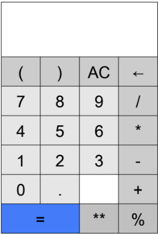
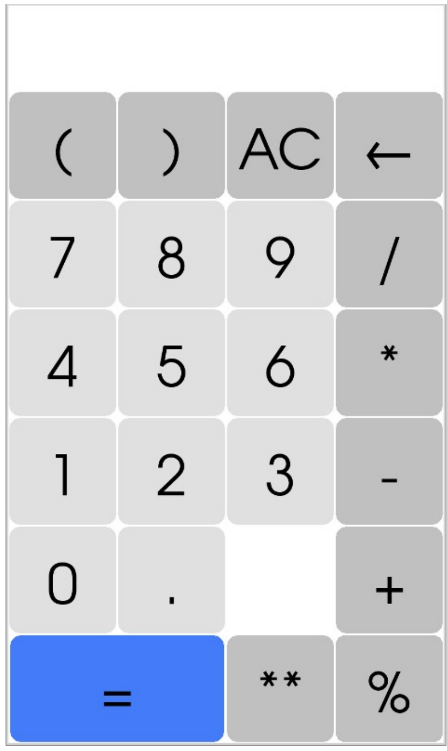

For the homework portion of this activity, you may have the option to work in groups (pending prof
approval). It is suggested that groups contain at least one confident Python coder.
Your task is to implement the following improvements to the calculator:

(1) Add a modulus (%) button that calculates the remainder returned by a division. For example: 23 % 13 = 10.
(2) Add a back button that removes the last (i.e., right-most) character in the display.
(3) Modify the layout as follows to accommodate the new buttons:

{fig-align="center"}

See below for what that should look like on the RPi.

(4) Limit the display to 14 characters. Do not allow the user to enter more than 14 characters.
(5) Any result that is greater than 14 characters should be truncated to the first 11 characters followed by three successive dots. For example: 2 ** 47 = 14073748835...
(6) If an expression result (or an error) has just been put on the display, clear the screen before displaying the next character inputted by the user.

A few notes:

• The calculator has now increased by one row. This has the unfortunate effect of no longer

{fig-align="center"}

properly rendering the calculator on the LCD touchscreen. To fix this, we can reduce the font size of text in the display from 50 point to 45 point. Furthermore, we can reduce the height of the display from two characters to one character.

• The equals (=) button now spans two columns. You will have to download the new image for this button.
• There is now a blank “button” on the calculator. Feel free to just leave this “button” blank.

**Do not make any additional improvements to your submission for this assignment.** However, feel free to do so on your own if you wish (although you may need to recreate the buttons if you choose to add more rows or columns to the calculator).

**You are to submit your Python source code only (as a .py file) through the upload facility on the web site.**
